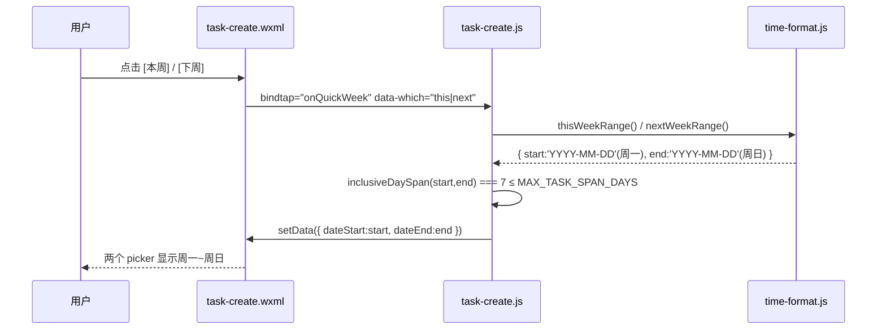
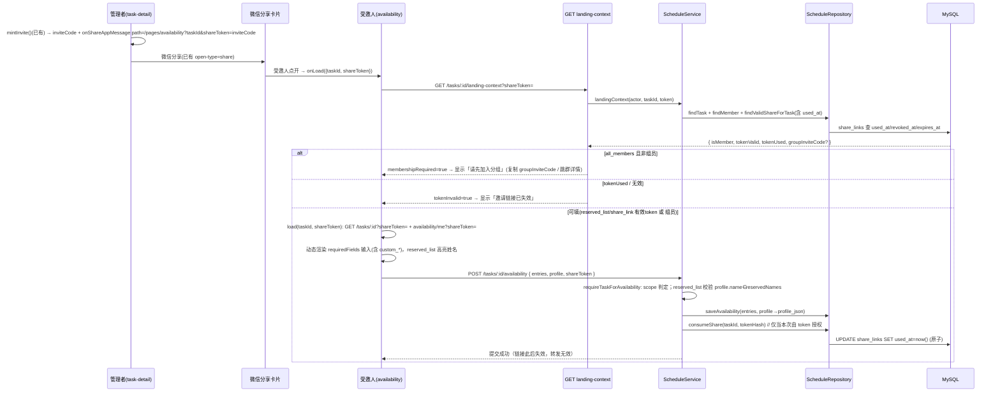

# 排班小程序 · 增量架构设计 + 任务分解（2026-07-21）

> **文档性质**：增量设计。仅描述本次 5 项变更在**现有架构**上的最小改动路径，不复述已有功能。
> **输出语言**：中文
> **定位**：工程师据此直接照做的清单（前端 = WeChat 小程序 WXML/WXSS/JS；后端 = NestJS/Fastify + Kysely/MySQL + ioredis）。
> **关联 PRD**：`docs/prd/scheduling-enhance-prd-2026-07-21.md`（含 Q1–Q6 待确认项）。

---

## 1. 实现方案 + 框架选型

**技术栈完全沿用现有**，无任何新增框架/运行时：

| 层 | 现状 | 本次是否改动 | 说明 |
|----|------|--------------|------|
| 小程序端 | WXML/WXSS/JS + TDesign 小程序版 | 改动 | 纯前端项（E5/E9/E10/E6/E1/E2/E7 前端侧） |
| 后端 | NestJS 11 + Fastify + Kysely(MySQL) | 改动 | E4/E3/E7 后端侧，扩展校验/存储/鉴权 |
| 存储 | MySQL（`share_links`、`availability_submissions` 等） | 改动 | 新增 2 个列（见 §3） |
| 缓存 | Redis（ioredis，已接入） | **不改动** | 单次性用 DB 列即可，无需 Redis（见 Q6 判断） |
| 复用组件 | `components/schedule-grid`、`utils/time-format.js`、`domain/period-builder.js`、`domain/date-defaults.js` | 复用 | 周计算函数挂在 `time-format.js` |

**每项改动方式（纯前端 / 前端+后端 / 仅后端）：**

| PRD 编号 | 需求 | 改动方式 | 关键改动点 |
|----------|------|----------|------------|
| E9 | 区块改名 | **纯前端** | `task-create.wxml:82` 文案一处 |
| E5 | 本周/下周按钮 | **纯前端** | 新增 3 个工具函数 + 2 个按钮 + `setData` |
| E10 | 时段规则 2 列 | **纯前端** | `task-create.wxml` 预览区改 2 列网格 + WXSS |
| E6 | 自定义必填项（前端） | **前端** | 输入+添加 UI + payload 携带 labels |
| E4 | 自定义必填项（后端） | **后端** | 校验 `custom_*`、持久化 labels 与 profile |
| E1 | 分享入口可达 | **前端（极小）** | 确认 manager 可见性已满足，补必要可达路径 |
| E2 | path 携带邀请标识 | **前端（已具备）** | `task-detail.js onShareAppMessage` 已注入，仅需核对 |
| E3 | 分享单次有效+禁转发 | **后端** | `share_links.used_at` 列 + 消费逻辑 |
| E7 | 按参与方式鉴权 | **前端+后端** | 后端 `requireTaskForAvailability`/读权限扩展；前端落地页流程 |
| E8 | `wx.showShareMenu`/朋友圈 | **前端（默认不做）** | 见 Q4，默认跳过 |

---

## 2. 改动文件列表（相对仓库根）

### 小程序端 `apps/miniprogram/`
| 文件 | 操作 | 关联 |
|------|------|------|
| `utils/time-format.js` | **修改** | E5：导出 `mondayOfYmd` / `thisWeekRange` / `nextWeekRange` |
| `pages/task-create/task-create.wxml` | **修改** | E9（:82 文案）、E5（按钮）、E10（:126-135 网格）、E6（必填区输入行） |
| `pages/task-create/task-create.js` | **修改** | E5（点击 handler）、E6（自定义项状态 + payload） |
| `pages/task-create/task-create.wxss` | **修改** | E10（2 列网格样式） |
| `pages/task-detail/task-detail.js` | **修改（核对+微调）** | E2/E1：确认 `onShareAppMessage` path；E7：单次性错误提示 |
| `pages/task-detail/task-detail.wxml` | **修改（极小）** | E1：确认分享按钮可达（manager+minted 已满足） |
| `pages/group-detail/group-detail.wxml` | **不改（确认）** | E1：群邀请分享维持 manager-only（见 Q5 默认） |
| `pages/availability/availability.js` | **修改** | E7：携带 token 加载、动态必填项（含 custom）、会员/名单校验、失效提示 |
| `pages/availability/availability.wxml` | **修改** | E7：动态必填项 UI、加入分组引导、失效态 |

### 后端 `services/api/`
| 文件 | 操作 | 关联 |
|------|------|------|
| `src/database/migrations/005_scheduling_share_profile.ts` | **新建** | E3：`share_links.used_at`；E4：`availability_submissions.profile_json` |
| `src/scheduling/schedule.service.ts` | **修改** | E4：`validateRules` 接受 `custom_*`+`requiredFieldLabels`；E3/E7：`submitAvailability`/`requireTaskForAvailability`/`getTask` 扩展 |
| `src/scheduling/schedule.controller.ts` | **修改** | E7：新增 `GET /tasks/:id/landing-context`；`getTask`/`availability/me` 透传 `shareToken` |
| `src/scheduling/schedule.repository.ts` | **修改** | E3：`findValidShareForTask` 加 `used_at`、`consumeShare`；E4：`saveAvailability` 落 `profile_json`；类型 `TaskRules` 扩展 |

**依赖包**：本次**无需新增任何 npm 包**（前端、后端均无）。`ioredis` 已存在但本次不用。

---

## 3. 数据结构与接口

### 3.1 新增「本周/下周」工具函数（前端 `utils/time-format.js`）

复用既有 `addDaysYmd`（本地时区 YMD 计算）与 `formatYmd`。

```js
/**
 * 返回 ymd 所在周的周一（周一为一周起点）。
 * @param {string} ymd 'YYYY-MM-DD'
 * @returns {string} 周一的 'YYYY-MM-DD'
 */
function mondayOfYmd(ymd) {
  const base = formatYmd(ymd);
  if (!base) return '';
  const d = new Date(`${base}T00:00:00`);           // 本地时区
  const dow = d.getDay();                            // 0=周日 .. 6=周六
  const back = dow === 0 ? -6 : 1 - dow;            // 回退到周一
  return addDaysYmd(base, back);
}

/**
 * 计算某 ymd 所在自然周（周一~周日）。
 * @returns {{start:string, end:string}} 周一~周日，跨度恒 7 天（≤ MAX_TASK_SPAN_DAYS）
 */
function weekRange(ymd) {
  const mon = mondayOfYmd(ymd);
  return { start: mon, end: addDaysYmd(mon, 6) };
}

/** 本周（基于今天）。 */
function thisWeekRange() {
  return weekRange(todayYmd());
}

/** 下周（基于今天，或基于给定 ymd 推算下周一）。 */
function nextWeekRange(ymd) {
  const mon = mondayOfYmd(ymd || todayYmd());
  const nextMon = addDaysYmd(mon, 7);
  return { start: nextMon, end: addDaysYmd(nextMon, 6) };
}
```

> **合规保证**：周一~周日为 7 天整，恰好等于 `MAX_TASK_SPAN_DAYS=7`，不会触发 `onDateChange` 的 ≤7 天拦截。

### 3.2 自定义必填项（E6 前端 + E4 后端）

**前端 `requiredFieldOptions` 单条结构（扩展）：**
```ts
type RequiredFieldOption = {
  key: string;        // 固定项: 'name'|'studentId'|'phone'；自定义项: 'custom_<slug>'
  label: string;      // 展示名；自定义项=用户输入
  custom?: boolean;   // 标识是否自定义项
};
```

**前端提交 payload 变更（`buildCreatePayload` → `rules`）：**
```ts
rules: {
  requiredFields: string[];                 // 选中的 key 列表，含 'custom_xxx'（向后兼容：旧任务只有固定 key）
  requiredFieldLabels?: Record<string,string>; // 新增：{ 'custom_dorm': '宿舍号' }，仅自定义项必填，固定项可省略
  participantScope: 'all_members'|'share_link'|'reserved_list';
  // ...既定字段不变
}
```

**后端 `TaskRules`（扩展类型，向后兼容）：**
```ts
type RequiredFieldSpec = string | { key: string; label?: string };
type TaskRules = {
  requiredFields: RequiredFieldSpec[];                 // 归一化后以 string[] 落库
  requiredFieldLabels?: Record<string, string>;        // 新增：custom_* -> label
  participantScope: 'all_members' | 'share_link' | 'reserved_list';
  reservedNames?: string[];
  allowEditAfterSubmit: boolean;
  maxEditCount: number;
  remindBeforeMinutes: number | null;
  saveAsTemplate?: boolean;
  templateName?: string;
};
```
- 旧任务的 `rules_json` 只有 `requiredFields: string[]`，无 `requiredFieldLabels` → 解析后正常，无破坏。
- `validateRules` 新增规则：
  - 每个 requiredField：固定 key（`name/studentId/phone`）通过；否则必须满足 `/^custom_[A-Za-z0-9_]{1,48}$/`，且 `requiredFieldLabels[key]` 存在且 `1..40` 字。
  - 拒绝其它任意 key（安全：防止注入未知字段）。

**提交可用性时的 profile（E4 落库）：**
```ts
// POST /tasks/:id/availability  body.profile
{
  name?: string;
  studentId?: string,
  phone?: string,
  "custom_dorm"?: string,   // 任意 custom_* 透传并校验必填
  // ...
}
```
后端 `saveAvailability` 将整份 `profile` 写入 `availability_submissions.profile_json`（见 §3.4）。**注**：当前 `profile` 仅被校验未落库，本次一并修复（附加式，不破坏旧数据）。

### 3.3 分享 `shareToken` / `inviteCode` 数据结构（E3 单次有效）

新增列（DB，非 Redis）：

```sql
-- share_links 增加单次性标记
ALTER TABLE share_links ADD COLUMN used_at datetime(3) NULL;
```

| 字段 | 类型 | 说明 |
|------|------|------|
| `token_hash` | char(64) unique | `sha256(inviteCode)`，现状已有 |
| `expires_at` | datetime(3) | 现状已有（manager mint 时 = now+expiresInHours） |
| `revoked_at` | datetime(3) | 现状已有（manager 可撤销） |
| `used_at` | **datetime(3) NULL（新增）** | 首次成功提交后写入 → 链接失效（单次有效） |
| `access_count` | int | 现状已有（公开分享页计数，不用于鉴权） |

**单次性落地策略（Q6 判断）：** 用 DB 列 `used_at` 而非 Redis。理由：① 与现有 `share_links` 表同源，事务一致；② 提交即消费，天然原子；③ 无需引入新组件。Redis 仅在后续需要「同设备防抖/限频」时再考虑，本次不做。

**失效/转发判定：**
- `findValidShareForTask(taskId, tokenHash)` 条件增加 `AND used_at IS NULL`。
- 消费：`consumeShare(taskId, tokenHash)` → `UPDATE ... SET used_at=now() WHERE task_id=? AND token_hash=? AND used_at IS NULL AND revoked_at IS NULL AND expires_at>now()`，返回受影响行数；为 0 表示已用/过期/撤销。
- **禁转发**：链接一旦被首人提交即 `used_at` 置位，转发给第二人时校验失败 → 「链接已失效」。

### 3.4 参与方式（E7）权限校验接口与流程

`requireTaskForAvailability(actorId, taskId, shareToken?)` 扩展逻辑：

| participantScope | 活跃组员 | 非组员 + 有效 token | 非组员无 token |
|------------------|----------|---------------------|----------------|
| `all_members` | ✅ 可提交 | ❌ `403 MEMBERSHIP_REQUIRED`（前端引导加组） | ❌ 同上 |
| `share_link` | ✅ 可提交 | ✅ 可提交（token 授权） | ❌ `404` 不可达 |
| `reserved_list` | ✅ 可提交 | ✅ 可提交，但**提交时 `profile.name` 必须 ∈ `reservedNames`**（否则 `400 RESERVED_NAME_MISMATCH`） | ❌ 不可达 |

**读权限（落地页加载）：** 现有 `getTask`/`availability/me` 要求组员。外部受邀人（reserved_list/share_link）需要**无组员身份也能加载落地页**，故扩展：
- `GET /tasks/:id` 与 `GET /tasks/:id/availability/me` 增加可选 `?shareToken=`，当 scope≠`all_members` 且 token 有效（未用/未撤/未过期）时放行只读。
- 新增 `GET /tasks/:id/landing-context?shareToken=`：无组员要求，返回安全上下文，供前端决定 UI：
  ```ts
  // 200
  {
    taskId: string;
    groupId: string;
    groupName: string;
    participantScope: 'all_members'|'share_link'|'reserved_list';
    isMember: boolean;
    tokenValid: boolean;     // token 存在且未用/未撤/未过期
    tokenUsed: boolean;      // used_at 已置位
    groupInviteCode?: string; // 仅 !isMember 时返回，供加组
  }
  ```
  > 该端点**只泄露组 id/名称/邀请码**，不泄露课表/成员等敏感数据，安全。

### 3.5 类图（Mermaid）

```mermaid
classDiagram
    class TimeFormat {
        +addDaysYmd(ymd, days) string
        +formatYmd(v) string
        +MAX_TASK_SPAN_DAYS int
        +mondayOfYmd(ymd) string
        +weekRange(ymd) ~start,end~
        +thisWeekRange() ~start,end~
        +nextWeekRange(ymd) ~start,end~
    }
    class TaskCreatePage {
        +data.requiredFieldOptions: RequiredFieldOption[]
        +data.requiredFields: string[]
        +data.requiredFieldLabels: map
        +data.customInput: string
        +onQuickWeek(which) void
        +addCustomField() void
        +toggleRequiredField(e) void
        +buildCreatePayload() object
    }
    class AvailabilityPage {
        +data.shareToken: string
        +data.task: ScheduleTask
        +data.requiredFields: string[]
        +data.requiredFieldLabels: map
        +data.customProfile: map
        +data.membershipRequired: boolean
        +data.tokenInvalid: boolean
        +loadLandingContext() void
        +load(taskId) void
        +buildProfile() object
        +submit() void
    }
    class ScheduleService {
        +createTask(actorId, groupId, input) Task
        +submitAvailability(actorId, taskId, entries, reqId, shareToken?, profile?) void
        +requireTaskForAvailability(actorId, taskId, shareToken?) Task
        +getTask(actorId, taskId, shareToken?) Task
        +landingContext(actorId, taskId, shareToken?) object
        -validateRules(rules) TaskRules
    }
    class ScheduleRepository {
        +createTask(input) Task
        +saveAvailability(taskId, userId, entries, reqId, profile?) void
        +findValidShareForTask(taskId, tokenHash) boolean
        +consumeShare(taskId, tokenHash) int
        +ensureCollectionDraftVersion(taskId, actorId) string
    }
    class ShareLinks {
        <<DB table>>
        +id binary(16)
        +task_id binary(16)
        +token_hash char(64) UNIQUE
        +expires_at datetime(3)
        +revoked_at datetime(3)
        +used_at datetime(3)  /* 新增 */
        +access_count int
    }
    class AvailabilitySubmissions {
        <<DB table>>
        +id binary(16)
        +task_id binary(16)
        +user_id binary(16)
        +submission_version int
        +profile_json json  /* 新增：name/studentId/phone/custom_* */
    }
    class TaskRules {
        <<type>>
        +requiredFields: (string|{key,label})[]
        +requiredFieldLabels?: map
        +participantScope: enum
        +reservedNames?: string[]
    }
    TimeFormat <.. TaskCreatePage : 复用
    TaskCreatePage ..> ScheduleService : POST /groups/:gid/tasks
    AvailabilityPage ..> ScheduleService : GET /tasks/:id/landing-context
    AvailabilityPage ..> ScheduleService : POST /tasks/:id/availability
    ScheduleService ..> ScheduleRepository
    ScheduleRepository ..> ShareLinks
    ScheduleRepository ..> AvailabilitySubmissions
    ScheduleService ..> TaskRules
```

---

## 4. 程序调用流程

### 4.1 点击「本周/下周」→ setData 数据流（E5）



实现要点：`onQuickWeek(e)` 读取 `e.currentTarget.dataset.which`，调用对应 range 函数，`setData` 后复用既有 `nextFromStep1` 的 ≤7 天校验自然通过。

### 4.2 提交自定义必填项（E6 前端 → E4 后端）

```mermaid
sequenceDiagram
    participant U as 管理者
    participant C as task-create.js
    participant API as NestJS /groups/:gid/tasks
    participant S as ScheduleService
    participant R as ScheduleRepository

    U->>C: 输入「宿舍号」点 [+ 添加]
    C->>C: addCustomField(): slug=genSlug(label); key='custom_'+slug
    C->>C: push {key,label,custom:true} 到 requiredFieldOptions
    C->>C: requiredFieldLabels[key]=label; requiredFields 含 key
    U->>C: 点 [发布并开始收集]
    C->>C: buildCreatePayload(): rules.requiredFields=keys[]
    C->>C: rules.requiredFieldLabels={custom_dorm:'宿舍号'}
    C->>API: POST body(rules...)
    API->>S: createTask(actor, gid, input)
    S->>S: validateRules(): 固定key通过；custom_* 校验前缀+label必填
    S->>R: createTask(): rules_json 含 requiredFields+requiredFieldLabels
    R-->>API: Task
    API-->>C: { id }
```

### 4.3 分享邀请链接 → 落地页鉴权 → 填写（E2/E3/E7 完整链路）



---

## 5. 任务清单（按实现顺序，含依赖）

> 分组遵循「≤5 个顶层任务」原则，每个任务标注**归属（前端/后端）**与**对应 PRD 编号（E1–E10）**。任务内给出「改哪个文件 / 哪个函数 / 加什么 UI」。

| 任务 | 归属 | 对应 | 依赖 | 优先级 | 改动要点 |
|------|------|------|------|--------|----------|
| **T1 轻量前端（改名+快捷周+2列）** | 前端 | E9, E5, E10 | 无 | P0/P1/P2 | 见下 |
| **T2 自定义必填项（前端）** | 前端 | E6 | T1 | P1 | 见下 |
| **T3 自定义必填项（后端）** | 后端 | E4 | 无（可与 T2 并行） | P1 | 见下 |
| **T4 分享入口可达性 + path 核对** | 前端 | E1, E2, E8 | 无 | P0 | 见下 |
| **T5 分享单次性 + 参与方式鉴权（后端+前端）** | 后端+前端 | E3, E7 | T3, T4 | P0/P1 | 见下 |

### T1 — 轻量前端（改名 + 本周/下周 + 时段规则 2 列）
- **E9**：`task-create.wxml:82` `常见校园起点` → `常用作息起点`（仅文案）。
- **E5**：
  - `utils/time-format.js`：新增 `mondayOfYmd`/`weekRange`/`thisWeekRange`/`nextWeekRange` 并加入 `module.exports`（复用 `addDaysYmd`/`formatYmd`/`MAX_TASK_SPAN_DAYS`）。
  - `task-create.wxml`：在 dateStart/dateEnd `picker`（:28-45）之间插入 `[本周][下周]` 两个 `view`，`bindtap="onQuickWeek" data-which="this|next"`。
  - `task-create.js`：新增 `onQuickWeek(e)`，依据 `which` 调 `thisWeekRange()`/`nextWeekRange()`，`setData({dateStart,dateEnd})`（7 天合规）。
- **E10（Q2 判断）**：PRD「时段规则表格」= Step2 的 `period-preview` 列表（`task-create.wxml:126-135`，节次 `period-code` + 时段 `period-label` 预览）。改为 2 列网格：
  - `task-create.wxml`：将 `wx:for` 的每行 `period-line` 改为网格卡片容器（2 列 `display:flex; flex-wrap:wrap` 或 `grid-template-columns:1fr 1fr`）。
  - `task-create.wxss`：新增 `.period-grid`（2 列）与 `.period-card`（卡片样式），保留 `period-code`/`period-label` 字段。
- **验收**：按钮点击后 picker 显示周一~周日；预览区 2 列；标题已改。

### T2 — 自定义必填项（前端，E6）
- `task-create.wxml` 必填信息区（:206-218）：
  - 在 `chip-row` 下方加输入行：`<input placeholder="如 宿舍号" value="{{customInput}}" bindinput="onCustomInput"/>` + `<button bindtap="addCustomField">+ 添加</button>`。
  - 自定义项渲染沿用 `requiredFieldOptions` 循环（已是 `wx:for`，自动包含 custom 项；用 `item.custom` 控制样式如删除按钮）。
- `task-create.js`：
  - `data` 增加 `customInput:''`、`requiredFieldLabels:{}`。
  - `onCustomInput(e)` → `setData({customInput:e.detail.value})`。
  - `addCustomField()`：`label=customInput.trim()`；校验非空、≤40 字、不与已有 label 重复；生成 `key='custom_'+slugify(label)`（slug 用 `Date.now().toString(36)` 或拼音/随机，保证唯一）；`push` 到 `requiredFieldOptions`（标记 `custom:true`）；`requiredFieldLabels[key]=label`；默认选中（`requiredFields` 含 key、`requiredFieldMap[key]=true`）；清空 `customInput`。
  - `toggleRequiredField` 保持不变（已支持任意 key）。
  - `buildCreatePayload()`：`rules.requiredFields = this.data.requiredFields`（已含 custom key）；新增 `rules.requiredFieldLabels = this.data.requiredFieldLabels`。
- **验收**：添加「宿舍号」后 chip 出现且默认选中；提交后后端收到 `custom_dorm` + label。

### T3 — 自定义必填项（后端，E4）
- **迁移** `src/database/migrations/005_scheduling_share_profile.ts`：
  - `share_links` 加 `used_at datetime(3) NULL`（供 E3 复用，先行）。
  - `availability_submissions` 加 `profile_json json NULL`。
- `schedule.service.ts`：
  - 类型 `TaskRules` 增加 `requiredFieldLabels?`。
  - `validateRules`：遍历 `requiredFields`，固定 key 放行；否则须匹配 `/^custom_[A-Za-z0-9_]{1,48}$/` 且 `requiredFieldLabels[key]` 存在（1..40 字）；否则 `400 INVALID_REQUIRED_FIELD`。返回归一化 `requiredFields:string[]` + `requiredFieldLabels`。
  - `submitAvailability`：除固定字段外，对 `custom_*` 必填项校验 `profile[key]` 非空；将 `profile` 透传给 `saveAvailability`。
- `schedule.repository.ts`：
  - `saveAvailability(taskId, userId, entries, reqId, profile?)`：写入 `profile_json`。
  - `TaskRules` 类型同步扩展。
- **兼容性**：旧任务 `rules_json` 无 `requiredFieldLabels` → 解析正常；`profile_json` 旧行为（不传）仍 NULL，不破坏。

### T4 — 分享入口可达性 + path 核对（E1/E2/E8）
- `task-detail.js`：**核对** `onShareAppMessage`（:136-152）已注入 `path:/pages/availability/availability?taskId=&shareToken=encodeURIComponent(code)`（E2 已满足）。微调：当 `inviteCode` 为空（未 mint）时回退 path 保持现状即可。
- `task-detail.wxml`：确认分享按钮（:62，`open-type="share"`，`wx:if="{{inviteCode}}"`）位于 `wx:if="{{manage && task.canMintShare}}"` 内——管理者 mint 后即可见，**符合 E1 默认口径（Q5：邀请由管理者发放）**，无需放宽 `wx:if`。仅在需要时补一句引导文案「生成邀请后可微信分享」。
- `group-detail.wxml`：群邀请分享维持 `canManage` 可见（群加入邀请语义独立，不改）。
- **E8（Q4 默认）**：本次**不做** `wx.showShareMenu`/`onShareTimeline`（朋友圈=转发，与「禁止转发」冲突）。代码留空待后续确认。

### T5 — 分享单次性 + 参与方式鉴权（E3/E7，后端+前端）
**后端：**
- `schedule.repository.ts`：
  - `findValidShareForTask` 增加 `AND used_at IS NULL`。
  - 新增 `consumeShare(taskId, tokenHash): Promise<number>`（`UPDATE ... SET used_at=now() WHERE ... AND used_at IS NULL AND revoked_at IS NULL AND expires_at>now()`，返回 affected rows）。
- `schedule.service.ts`：
  - `requireTaskForAvailability` 按 §3.4 表扩展：all_members 非组员 → `ForbiddenException('MEMBERSHIP_REQUIRED')`；reserved_list 非组员需有效 token 且**提交阶段**校验 `profile.name ∈ reservedNames`（`BadRequestException('RESERVED_NAME_MISMATCH')`）；share_link 需有效 token。
  - `submitAvailability`：若本次由 token 授权（非活跃组员但 token 有效），`saveAvailability` 成功后调用 `consumeShare`；若 `consumeShare` 返回 0（并发已被用）→ 抛 `ConflictException('SHARE_TOKEN_USED')`。token 无效/过期 → `ConflictException('SHARE_TOKEN_INVALID')`。
  - `getTask(actorId, taskId, shareToken?)`：活跃组员直接返回；否则 scope≠`all_members` 且 `findValidShareForTask` 通过 → 返回（只读）；否则维持 `NotFound`/`Forbidden`。
  - 新增 `landingContext(actorId, taskId, shareToken?)`：返回 §3.3 结构（含 `groupInviteCode`）。
- `schedule.controller.ts`：
  - `getTask` / `availability`(me) 增加 `?shareToken=` 透传。
  - 新增 `GET tasks/:taskId/landing-context`（用 `UserAuthGuard`，组员要求仅登录）。

**前端（`availability.js` / `.wxml`）：**
- `onLoad`：先 `loadLandingContext()`（新增），据返回决定：
  - `membershipRequired` → 显示「请先加入分组」区块，提供 `groupInviteCode` 复制 + 跳 `pages/group-detail/group-detail?id={{groupId}}`（或群加入流程）。
  - `tokenInvalid||tokenUsed` → 显示「邀请链接已失效」。
  - 否则 `load(taskId, shareToken)`（GET 带 `?shareToken=`）。
- `load`：读 `task.rules.requiredFields` 与 `requiredFieldLabels`；`data` 增加 `requiredFieldLabels`、`customProfile:{}`、`membershipRequired`、`tokenInvalid`。
- UI：必填项改为**动态渲染**——遍历 `requiredFields`，固定项用原输入框，`custom_*` 用通用输入框绑定 `customProfile[key]`；reserved_list 时姓名输入框高亮「需与名单一致」。
- `buildProfile()`：重构为遍历 `requiredFields`——固定 key 取对应 state；`custom_*` 取 `customProfile[key]`；缺失返回 null 并 toast。
- `submit()`：将 `profile`（含 custom_*）随 body 发出，保留 `shareToken`；捕获 `SHARE_TOKEN_USED`/`SHARE_TOKEN_INVALID`/`MEMBERSHIP_REQUIRED`/`RESERVED_NAME_MISMATCH` 给出对应中文提示。

---

## 6. 依赖包列表

**本次无需新增任何 npm 包。**

| 包 | 现状 | 本次 |
|----|------|------|
| 小程序端（无构建依赖，原生 WXML/JS） | — | 不新增 |
| `@nestjs/*`、`fastify`、`kysely`、`mysql2`、`ioredis`、`zod`、`jose`、`uuid` | 已安装 | 复用，不新增 |
| `redis`（ioredis 实例） | 已接入，`REDIS` token | E3 不用（用 DB 列） |

---

## 7. 共享知识（跨文件约定）

| 约定 | 取值 / 规则 | 适用 |
|------|-------------|------|
| 自定义字段 key 前缀 | 必须以 `custom_` 开头，后缀 `[A-Za-z0-9_]{1,48}`，例 `custom_dorm` | 前端生成 + 后端校验统一 |
| 自定义字段 label | 存于 `requiredFieldLabels[key]`（仅自定义项），1–40 字；**落库于 `rules_json`** | 前后端一致 |
| 自定义字段取值 | 提交时置于 `profile['custom_xxx']`，后端存入 `availability_submissions.profile_json` | 前后端一致 |
| 周计算函数 | 挂在 `utils/time-format.js`，命名 `mondayOfYmd`/`weekRange`/`thisWeekRange`/`nextWeekRange`，复用 `addDaysYmd`/`formatYmd` | 前端统一引用 |
| 7 天上限 | `MAX_TASK_SPAN_DAYS=7`（time-format.js）；周一~周日恰 7 天，E5 无需额外拦截 | 前后端复用 |
| shareToken 字段名 | 统一叫 `shareToken`（URL 参数 + body + 请求头 `x-share-token` 三处一致） | 前后端一致 |
| 单次性实现 | DB 列 `share_links.used_at`；消费原子 `UPDATE ... WHERE used_at IS NULL` | 后端统一 |
| 错误码（新增） | `SHARE_TOKEN_INVALID`、`SHARE_TOKEN_USED`、`MEMBERSHIP_REQUIRED`、`RESERVED_NAME_MISMATCH`、`INVALID_REQUIRED_FIELD` | 后端抛、前端显 |
| 应用代码名 | 「智能排班」（`app.json:4`）本次**不改**；仅改 `task-create.wxml:82` 区块标题 | 前端 |

---

## 8. 待明确事项（Q1–Q6）+ 建议默认值

| 编号 | 问题 | 建议默认值（工程师先按此实现） |
|------|------|-------------------------------|
| **Q1** | 改名范围：仅区块标题还是微信公众平台对外名？ | 按 PRD 决策：**仅改 `task-create.wxml:82` 文案**；`app.json` 代码名不改。MP 后台名不在代码内，转交运营确认。 |
| **Q2** | 「时段规则表格」具体改哪块？ | 判断为 **Step2 的 `period-preview` 节次/时段预览列表（wxml:126-135）**，改 2 列网格。若工程确认是别处，以该列表为准。 |
| **Q3** | 自定义字段后端存储方案 | `custom_` 前缀统一；label 落库 `rules_json.requiredFieldLabels`；取值落库 `availability_submissions.profile_json`；校验前缀+label 必填+去重（前端已去重）。**后端不再额外建表**。 |
| **Q4** | 是否需要 `wx.showShareMenu`/朋友圈 | **默认不做**（朋友圈=转发，与「禁止转发」冲突）。代码留空，待用户确认后再补。 |
| **Q5** | 分享入口开放规则 / 所有成员加组引导 | 默认：**邀请由管理者生成并分享**（维持 `manage && canMintShare` 可见性）；`all_members` 受邀人通过**群邀请码加组**后再填（落地页 `membershipRequired` 引导）；`reserved_list` 受邀人凭 token + 姓名入名单填写。 |
| **Q6** | 单次有效实现方式（Redis/DB） | **用 DB 列 `share_links.used_at`**，原子消费，不引入 Redis。转发失效由「首次提交即置位」自然达成。 |

> 以上默认值为最小变更路径，工程师可先按此实现；若用户后续推翻某默认值，仅需局部调整对应任务，不影响其它任务。

---

## 9. 兼容性小结（后端契约）

- `POST /groups/:gid/tasks`：新增可选 `rules.requiredFieldLabels`，旧调用方不传则忽略（向后兼容）。
- `rules.requiredFields` 仍接受 `string[]`（旧），新调用方可传含 `custom_*` 的数组；类型层兼容 `string | {key,label}` 输入、归一化为 `string[]` 存储。
- `POST /tasks/:id/availability`：`profile` 新增任意 `custom_*` 透传；新增 `profile_json` 列（可 NULL，旧数据不受影响）；新增错误码均带 `error.code` 供前端区分。
- `share_links.used_at` 为可 NULL 新增列，旧分享记录 `used_at=NULL` 视为未用，行为不变（仅新逻辑会消费）。
- 新增 `GET /tasks/:id/landing-context` 为纯新增端点，不影响既有接口。
