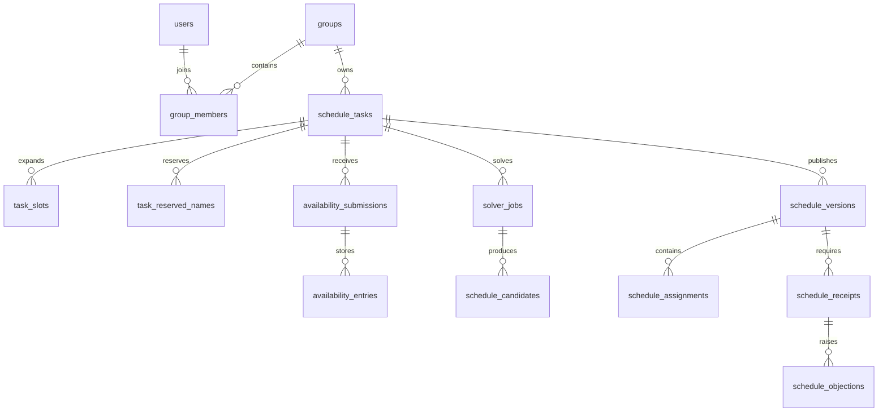

# MySQL 8.4 Schema

All tables use InnoDB, `utf8mb4`, UTC `DATETIME(3)`, application-generated UUIDv7 stored as `BINARY(16)`, and optimistic `version` where a mutable aggregate exists. Foreign keys use `RESTRICT` for business identities and soft deletion is preferred over physical deletion.

## Migration map

| Migration | Scope | Main tables |
| --- | --- | --- |
| `001_foundation` | Identity and audit | `users`, `admin_accounts`, `audit_logs` |
| `002_identity_groups` | Privacy and groups | `user_private_profiles`, `groups`, `group_members`, `group_invite_codes`, `group_member_events` |
| `003_user_sessions` | User refresh sessions | `user_sessions` |
| `004_scheduling_domain` | Tasks and publication | `shift_templates`, `shift_periods`, `schedule_tasks`, `task_slots`, `availability_submissions`, `availability_entries`, `solver_jobs`, `solver_snapshots`, `schedule_candidates`, `schedule_versions`, `schedule_assignments`, `schedule_receipts`, `schedule_objections`, `share_links` |
| `005_reliability` | Idempotency and delivery | `command_idempotency`, `notification_outbox` |
| `006_admin_mfa` | Optional admin second factor | `admin_mfa_factors` |
| `007_user_lifecycle` | Deletion cooling period | `user_deletion_requests` |
| `008_scheduling_lifecycle_extensions` | Reusable templates, hard fixed assignments and objection resolution metadata | `task_fixed_assignments` plus `shift_templates.is_reusable` and `schedule_objections.resolution_note` |
| `009_task_collection_rules` | Task collection time mode, rules and reserved names | `schedule_tasks.time_mode`, `schedule_tasks.rules_json`, `task_reserved_names` |

## Relationship summary

## Sensitive data

`user_private_profiles` contains only AES-256-GCM ciphertext, IV, authentication tag, key version and authorization timestamp. API projections return masked phone numbers only. Tokens, passwords, WeChat secrets and ciphertext are excluded from logs and seed output. Ordinary notifications retain 90 days; ordinary audit logs retain at least one year; deletion enters a 30-day cooling period before the deadline worker clears identity and private profile data while preserving referential integrity.

`task_fixed_assignments` is a hard constraint input to the immutable solver snapshot. It references only active group members and task slots; replacing it is audited and is disabled after publication unless the task is explicitly in `adjusting`.

## Backup and restore

Use `tools/backup-mysql.sh` with `MYSQL_*` environment variables for a logical backup. It uses `mysqldump --single-transaction --routines --events --hex-blob`, writes a SHA-256 manifest and immutable-table summaries, and never places the password in command arguments. Restore into a separate database with `tools/restore-mysql.sh`; the script verifies the archive checksum and compares row-count/CRC summaries for audit logs, membership events and schedule versions before traffic is switched. Preserve binlogs separately for point-in-time recovery.

## Data dictionary

The migration files are the executable schema source of truth. This dictionary records stable ownership and sensitive fields. `id` values are UUIDv7 `BINARY(16)` unless noted otherwise; timestamps are UTC `DATETIME(3)`.

| Table | Primary purpose | Key columns and relationships | Sensitive/retention notes |
| --- | --- | --- | --- |
| `users` | WeChat user identity and platform status | `id`, `openid` unique, `nickname`, `status`, `anonymized_at` | `openid` is cleared after deletion cooling period; no token here |
| `admin_accounts` | Independent H5 identities | `id`, `username` unique, `password_hash`, `role`, `status` | Argon2id hash only; never expose hash |
| `audit_logs` | Immutable operator trail | `actor_type`, `actor_id`, `action`, `target_type`, `target_id`, `request_id`, `metadata_json` | Retain at least one year; metadata must be redacted |
| `user_private_profiles` | Encrypted optional phone profile | `user_id`, encrypted phone fields, `authorized_at`, `deleted_at` | AES-256-GCM ciphertext only; API returns masked projection |
| `groups` | Scheduling collaboration boundary | `id`, `name`, `owner_id`, `status`, `deleted_at` | Soft delete preserves audit and schedule references |
| `group_members` | User-to-group role and status | `group_id`, `user_id`, `display_name`, `role_in_group`, `status`, `is_blacklisted` | Active membership is required for every group query |
| `group_invite_codes` | Rotatable group invitation | `group_id`, `code` unique, `expires_at`, `revoked_at`, `created_by` | Never log or seed-print live codes |
| `group_member_events` | Membership lifecycle history | `group_id`, `member_id`, `actor_user_id`, `event_type`, `reason` | Append-only kick/leave/rejoin/blacklist history |
| `user_sessions` | Rotating user refresh sessions | `user_id`, `token_hash`, `expires_at`, `revoked_at`, `replaced_by` | Hash only; replay revokes token family |
| `shift_templates` | Reusable named shift configuration | `group_id`, `name`, `template_type`, `is_reusable`, `created_by`, `deleted_at` | Group-scoped; soft delete |
| `shift_periods` | Period definitions within a template | `template_id`, `code`, `label`, minute/day offsets, people bounds | Immutable after task expansion; supports overnight periods |
| `schedule_tasks` | Scheduling lifecycle aggregate | `group_id`, `template_id`, date range, `deadline`, `status`, `version`, `published_version`, `time_mode`, `rules_json` | State changes are audited and optimistic-versioned; `time_mode`/`rules_json` hold collection wizard config |
| `task_reserved_names` | Publisher-defined placeholder names for a task | `task_id`, `name`, `sort_order` | Cascades with task; ordered display list for collection UI |
| `task_slots` | Immutable date/period expansion | `task_id`, `period_id`, `slot_date`, absolute times, people bounds | Solver and publication reference these IDs |
| `availability_submissions` | Versioned member submission envelope | `task_id`, `user_id`, `submission_version`, `status`, `submitted_at` | Only submitter reads the latest version |
| `availability_entries` | Three-state slot availability | `submission_id`, `slot_id`, `state`, `note` | Notes are private; state is unavailable/available/preferred |
| `solver_jobs` | Asynchronous CP-SAT job state | `task_id`, `snapshot_hash`, `status`, `progress`, `attempts`, `idempotency_key`, `error_json` | Worker updates only job-owned fields |
| `solver_snapshots` | Immutable solver input | `job_id`, `task_id`, `snapshot_json` | Captures members, slots, availability and fixed assignments |
| `schedule_candidates` | Explainable solver alternatives | `job_id`, `candidate_index`, `score`, explanation and assignment JSON | API revalidates before publication |
| `schedule_versions` | Immutable published schedule versions | `task_id`, `version_number`, `status`, `published_by`, `published_at` | Old versions remain for audit and objections |
| `schedule_assignments` | Member-to-slot assignments | `version_id`, `slot_id`, `user_id`, `source`, `is_active` | Published projections mask phone numbers |
| `schedule_receipts` | Per-member acknowledgement | `version_id`, `user_id`, `status`, `received_at` | One row per active member and version |
| `schedule_objections` | Receipt objection and resolution | `receipt_id`, `slot_id`, `reason`, `status`, resolver fields | Resolution never edits the old version |
| `share_links` | Expiring/revocable public schedule link | `task_id`, `version_id`, `token_hash`, expiry/revocation fields | Store token hash only; public view excludes phones |
| `task_fixed_assignments` | Hard member requirements | `task_id`, `slot_id`, `user_id`, `created_by` | Validated and included in solver snapshots |
| `command_idempotency` | Idempotent command response cache | `scope`, `idempotency_key`, `response_json`, `created_at` | Purge according to command retention policy |
| `notification_outbox` | Transactional notification delivery | business key, recipient, event/payload, delivery status and retry fields | Redacted payload; retain 90 days |
| `admin_mfa_factors` | Optional encrypted TOTP factor | `admin_id`, encrypted secret fields, `enabled_at` | Secret is never returned after enrollment |
| `user_deletion_requests` | 30-day account deletion cooling period | `user_id`, `status`, requested/scheduled/cancelled/completed times | Worker anonymizes identity and revokes sessions |

### State values and invariants

`group_members.status` is `active`, `left`, or `kicked`; `role_in_group` is `owner`, `admin`, or `member`. `schedule_tasks.status` moves through `collecting`, `ready`, `solving`, `reviewing`, `published`, `adjusting`, and `failed`. Notification status is `pending`, `sending`, or `sent` in normal operation.

- Every external write enters through the API and carries a request ID plus audit event.
- Re-publication creates a new immutable version and revokes old share links.
- Availability detail is submitter-only; the management summary contains only counts and risk totals.
- Foreign-key `RESTRICT` protects identities and audit history; cascading deletes are limited to immutable child records.
