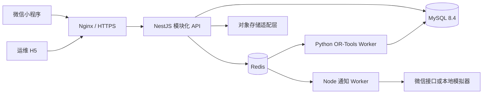

# 智能排班平台端到端设计规格

> 日期：2026-07-18
>
> 状态：已完成需求澄清，待用户书面复核
>
> 输入：`user-scenarios.md`、完整原型图及 13 项产品决策

## 1. 目标与边界

在 `new` 目录从零建设一套可本地完整运行、可部署到 Linux 的智能排班系统，包含：

- 原生微信小程序；
- React + TypeScript 运维 H5；
- Node.js 模块化 API；
- Google OR-Tools 智能排班 Worker；
- MySQL、Redis、对象存储适配层和 Nginx；
- 完整 API Markdown、OpenAPI 3.1 YAML、MySQL schema 与数据字典；
- Docker Compose 本地运行、生产部署样例、自动化测试和验收脚本。

产品遵循“默认简洁、按需展开、无权限不展示、敏感信息最小化”的原则。运维后台只管理平台级能力，不替分组发布者修改业务数据。

本期不在界面中引入组织/租户概念，但数据模型保留未来增加组织归属的扩展点。

## 2. 已确认产品决策

1. 部署：Linux + Docker + Node.js + MySQL + Redis。
2. 运维身份：独立管理员账号密码，与微信用户分离，支持可选 TOTP。
3. 排班：Google OR-Tools CP-SAT 真实约束求解，生成 3 套候选方案。
4. 微信能力：真实接口与本地模拟双模式。
5. H5：完整系统运维，但业务数据只读。
6. 手机号：可选授权、加密保存、按权限脱敏展示。
7. 组织：首版不展示，数据结构可扩展。
8. 时间：钟点、学校节次、自定义时段，支持跨午夜与模板复用。
9. 截止：自动结束收集，可提前结束、延长或重新开放并审计。
10. 分组角色：组主、多个管理员、成员。
11. 可用性：不可排、可排、优先安排三态，可附备注。
12. 分享：组内默认可见，可创建可撤销、可过期的脱敏公开链接。
13. 数据保留：软删除、分级保留、注销冷静期后匿名化。

## 3. 总体架构



### 3.1 仓库结构

```text
new/
  apps/
    miniprogram/           原生微信小程序
    admin-web/             React + TypeScript 运维 H5
  services/
    api/                   NestJS 模块化 API
    scheduler-worker/      Python + OR-Tools CP-SAT
    notification-worker/   BullMQ 通知与补偿任务
  packages/
    contracts/             DTO、枚举、错误码、OpenAPI 生成源
    design-tokens/         小程序与 H5 共用视觉变量
    test-fixtures/         场景数据与测试构造器
  infra/
    docker/                Compose、镜像和健康检查
    nginx/                 网关配置
    mysql/                 migrations、seed、备份脚本
  docs/
    api/                   API Markdown 与 OpenAPI YAML
    database/              ER 图、数据字典和 schema 说明
    operations/            部署、监控、备份和故障处理
    product/               数据流、权限和验收场景
```

### 3.2 服务边界

- API 是唯一外部业务写入口，小程序和 H5 不能绕过 API 规则直接修改状态。
- 内部 Worker 使用独立最小权限数据库账号，只能写各自拥有的求解任务、候选方案和投递结果表；正式发布、成员关系和任务状态仍由 API 校验并落库。
- 通知通过事务 Outbox 写入，Worker 至少一次投递，业务键去重。
- H5 与小程序使用独立认证域、独立令牌签发和独立权限守卫。
- 文件存储通过统一接口接入本地 MinIO 或生产 COS/OSS/S3，不把存储商逻辑写进业务模块。

## 4. 身份、权限与隐私

### 4.1 身份体系

- 微信用户：`wx.login` code 在服务端换取 `openid`，生产不向前端暴露微信密钥；本地模拟器签发固定测试身份。
- 运维账号：独立 `admin_accounts` 表，Argon2id 密码哈希；初始超管由初始化命令创建，后续管理员由超管创建。
- Access Token 短时有效，Refresh Token 轮换并支持服务端撤销；管理员会话支持 TOTP 与登录设备记录。
- 平台角色不会自动获得任何分组权限；同一自然人在小程序端仍按普通微信用户和分组成员关系处理。

### 4.2 分组权限矩阵

| 能力 | 组主 | 管理员 | 成员 | 非成员 |
|---|:---:|:---:|:---:|:---:|
| 查看分组与已发布排班 | 是 | 是 | 是 | 否 |
| 提交本人可用性/查收/异议 | 是 | 是 | 是 | 否 |
| 查看收集汇总 | 是 | 是 | 否 | 否 |
| 创建、生成、调整、发布任务 | 是 | 是 | 否 | 否 |
| 管理普通成员 | 是 | 是 | 否 | 否 |
| 任免管理员、转让、解散 | 是 | 否 | 否 | 否 |
| 查看已授权成员脱敏手机号 | 是 | 是 | 否 | 否 |

前端只负责隐藏无权入口以减少干扰；API 必须独立执行相同权限校验，不能依赖前端隐藏保证安全。

### 4.3 隐私策略

- 手机号不作为入组前置条件。授权后使用 AES-256-GCM 加密，保存密文、随机 IV 和密钥版本，不写日志。
- 公开分享页只显示脱敏姓名和班次，不返回手机号、可用性、备注、异议或成员档案。
- 收集阶段成员只能读取自己的可用性；管理员只能在任务收集视图读取必要汇总与成员提交状态。
- 用户注销有 30 天冷静期，到期匿名化昵称、头像、手机号等直接标识；安全审计仅保留匿名主体。
- 默认保留：通知记录 90 天、普通审计 1 年；周期可由超管配置但不得低于安全基线。

## 5. 核心领域模型

### 5.1 主要实体

- `users`：微信用户主体、状态、匿名化状态。
- `user_private_profiles`：加密手机号和隐私授权记录，与常用用户信息隔离。
- `admin_accounts`、`admin_sessions`、`admin_mfa_factors`：运维身份域。
- `groups`：分组、邀请码、组主、状态和版本。
- `group_members`：成员关系、角色、显示名、状态、黑名单和历史时间。
- `group_member_events`：加入、退出、踢出、解封、角色变化的不可变事件。
- `shift_templates`、`shift_periods`：钟点、节次、自定义时段模板。
- `schedule_tasks`：排班任务主记录和状态机版本。
- `task_slots`：任务展开后的具体日期与时段。
- `task_requirements`：每个时段人数、技能、固定人员等硬约束。
- `availability_submissions`、`availability_entries`：提交批次与三态可用性。
- `solver_jobs`、`solver_snapshots`：异步任务和不可变输入。
- `schedule_candidates`、`candidate_assignments`：候选方案、评分和解释。
- `schedule_versions`、`schedule_assignments`：正式发布版本与班次明细。
- `schedule_receipts`、`schedule_objections`：查收、异议与处理闭环。
- `share_links`：哈希令牌、有效期、撤销和访问统计。
- `notification_outbox`、`notification_deliveries`、`user_inbox`：通知链路。
- `audit_logs`：平台和关键业务操作审计。
- `system_settings`：可版本化的系统参数。

### 5.2 MySQL 规范

- MySQL 8.4、InnoDB、`utf8mb4`、UTC 存储，API 按用户时区展示。
- 主键使用应用生成的 UUIDv7，数据库使用 `BINARY(16)`；对外序列化为标准 UUID 字符串。
- 时间使用 `DATETIME(3)`；金额类字段不适用，评分使用定点整数避免浮点漂移。
- 所有可变业务表包含 `created_at`、`updated_at`、`version`；软删除表包含 `deleted_at`。
- 唯一约束覆盖活跃成员、邀请码、幂等键、任务版本和通知业务键。
- JSON 仅保存不可变求解快照、算法解释和第三方原始回执；可查询业务字段保持规范化。
- 迁移只向前执行；生产禁止应用启动时自动改表，部署阶段运行独立 migration job。

## 6. 状态机与数据流

### 6.1 分组成员状态

```text
invited -> active -> left -> active
                  -> kicked -> active
                  -> blacklisted -> active（仅组主解除后）
```

- 退出和踢出均保留历史。
- 踢出使尚未发布任务中的提交失效，并使既有排班关系失活，不物理删除。
- 黑名单用户不能通过邀请码重新加入。

### 6.2 排班任务状态

```text
draft -> collecting -> ready -> solving -> reviewing -> published -> completed
                    ^     |          |          |
                    |     +-> failed |          +-> adjusting -> published
                    +--------- reopened <-------+
draft/collecting/reviewing -> cancelled
```

- 截止任务自动从 `collecting` 进入 `ready`。
- 发布者可提前结束、延长或重开；状态变更要求版本匹配并写审计。
- 求解失败保留输入快照和错误分类，可重试但不重复生成同一业务任务。
- 重新发布创建新版本、重置查收、归档已处理异议并撤销旧分享链接。

### 6.3 创建与加入分组

1. 用户登录并获得小程序会话。
2. 创建者提交名称、模板和基础规则。
3. API 在单事务中创建分组、组主成员关系和邀请码。
4. 加入时按邀请码查询分组并锁定成员关系：
   - 不存在或失效：拒绝；
   - active：返回已加入；
   - left/kicked 且未黑名单：恢复 active；
   - blacklisted：拒绝并给出联系组主提示。
5. 成功事件写 Outbox，通知异步发送。

### 6.4 收集可用时间

1. 管理员创建任务，选择日期、时段、人数、约束和截止时间。
2. API 将模板展开为不可变 `task_slots`，发布后进入 `collecting`。
3. 成员以提交批次保存三态可用性；每次提交替换本人当前有效版本，历史版本可审计。
4. 默认未填写为不可排；备注仅本人和本组管理员可读取。
5. 截止 Worker 使用数据库时间和幂等锁将任务推进到 `ready`。

### 6.5 求解、调整与发布

1. API 在事务中冻结成员、时段、可用性和约束为 `solver_snapshot`。
2. BullMQ 创建唯一求解任务，返回 job id；小程序轮询或使用短轮询查看进度。
3. OR-Tools Worker 验证快照版本后求解，输出至少三套分数和权衡不同的候选方案。
4. 管理员可手动调整；API 重新验证时间冲突、人数、资格和版本。
5. 发布时写 `schedule_versions` 与明细、创建查收记录、撤销旧分享链接并写通知 Outbox。

### 6.6 查收与异议

1. 成员只能对当前发布版本查收或提出异议。
2. 异议包含原因与关联班次，不直接修改排班。
3. 管理员可拒绝并说明，或进入 `adjusting` 接受调整。
4. 新版本发布后全员查收重置，旧版本和异议处理轨迹保留。

### 6.7 运维信息流

- H5 通过独立 `/api/v1/admin/*` 接口访问。
- 仪表盘读取聚合指标；用户封禁、管理员变更、配置发布、通知重试均写审计。
- 分组、成员、任务和排班只提供只读摘要，不提供业务修改接口。
- 超管能查看服务健康、队列积压、失败任务、迁移版本和备份状态。

## 7. 智能排班模型

### 7.1 硬约束

- 只安排状态为 active 且属于该分组的成员。
- 不安排“不可排”或未提交时段。
- 同一成员的重叠时段不能同时安排。
- 满足每时段最低/目标/最高人数。
- 满足固定人员、必需技能、最大班次数和最小休息间隔。
- 跨午夜时段按绝对时间检测冲突。

### 7.2 软约束

- 优先满足“优先安排”。
- 最小化成员工作量方差。
- 限制连续班次和连续工作天数。
- 减少拆散的零碎班次和不必要的深夜班。
- 尽量接近目标人数，避免无意义超配。

### 7.3 候选与解释

- 候选 1：覆盖优先。
- 候选 2：均衡优先。
- 候选 3：偏好与连续性优先。
- 每套方案返回覆盖率、均衡度、偏好满足率、风险时段和未满足原因。
- 无可行解时返回最小冲突集合和可操作建议，不伪造“成功方案”。

## 8. API 设计规范

- 基础路径：`/api/v1`；资源使用复数名词，动作仅用于无法自然表达的领域命令。
- 遵循 HTTP 语义：GET 查询、POST 创建/命令、PATCH 局部更新、DELETE 撤销或软删除。
- 创建、发布、求解、通知重试等命令支持 `Idempotency-Key`。
- 列表统一使用游标分页，字段为 `items` 和 `nextPageToken`；支持受控 `filter`、`orderBy`。
- 错误体包含稳定 `code`、用户可读 `message`、字段级 `details`、`requestId`，HTTP 状态与错误类别一致。
- 乐观锁使用 `version` 或 `If-Match`，冲突返回 409。
- OpenAPI 3.1 YAML 是可导入 Apifox 的权威契约；Markdown 从同一契约补充场景、权限、示例和错误码。
- 每个请求生成 request id；日志为结构化 JSON，并对手机号、令牌、密码和微信凭证自动脱敏。

## 9. 界面设计

### 9.1 视觉方向

- 主色 `#22C55E`，辅蓝、警告橙、危险红只表达状态，不形成单色主题。
- 浅灰页面、白色工作面、细边框、低阴影；卡片圆角不超过 8px，弹窗可到 12px。
- 文字采用系统中文字体，紧凑但不拥挤；不用随视口缩放字号，不使用负字距。
- 图标优先使用 TDesign Mini Program 图标和 Ant Design Icons，不用文字矩形替代熟悉图标。
- 操作随权限和当前状态出现；不适用内容不占位，不展示“你没有权限”式死入口。
- 关键提交固定在安全区底部；危险操作必须二次确认并说明影响。

### 9.2 小程序信息架构

底部四栏：`首页 / 分组 / 日程 / 我的`。

- 首页：下一班、待提交、待查收、最近分组和单一主操作。
- 分组：完整分组列表、搜索、创建、邀请码加入。
- 分组详情：按身份展示任务、成员和设置；成员不看到管理页签。
- 创建任务：基本信息、时段与人数、约束与截止三步流程。
- 可用时间：周网格，点击/拖拽录入三态，提供撤销和提交摘要。
- 收集状态：管理员查看进度、未提交成员、风险时段和提醒入口。
- 智能排班：求解进度、三方案比较、负荷与风险、手动调整、发布确认。
- 结果：组内排班、我的班次、查收、异议、分享和日历同步。
- 日程：月/周视图切换，只展示用户有权查看的已发布班次。
- 我的：隐私授权、通知、账号注销、设置和帮助。

### 9.3 H5 信息架构

- 登录；
- 概览；
- 管理员账号；
- 用户与封禁；
- 分组只读；
- 任务与排班只读；
- 审计日志；
- 通知投递；
- 班次模板；
- 系统参数；
- 队列任务；
- 服务健康与备份状态。

H5 使用左侧窄导航和高密度工作区，重点支持筛选、比较和重复操作，不使用营销式大标题或装饰性卡片堆叠。

## 10. 错误处理与可靠性

- 数据库、Redis、微信和对象存储均有启动健康检查与运行时超时。
- 外部微信调用采用指数退避、抖动和可重试错误分类；永久失败进入人工重试列表。
- Outbox、求解和截止任务均以业务键幂等，避免重复发布、重复通知和重复状态迁移。
- API 使用数据库事务保护跨表不变量；长任务不持有数据库事务。
- 前端统一提供加载、空状态、离线、权限变化、版本冲突和网络重试反馈。
- 关键操作审计包含操作人、目标、前后摘要、原因、IP、UA、request id 和时间。

## 11. 部署与 MySQL 连接

### 11.1 Docker Compose 服务

- `nginx`
- `api`
- `admin-web`
- `scheduler-worker`
- `notification-worker`
- `mysql:8.4`
- `redis:7`
- `minio`（本地模式）
- `migration`（一次性任务）

### 11.2 MySQL 启动顺序

1. Docker 引擎必须可用。
2. MySQL 容器启动并通过 `mysqladmin ping`。
3. migration job 使用应用账号连接并执行迁移。
4. API 在数据库和 Redis 健康后启动。
5. smoke test 通过 API `/health/ready` 验证真实读写。

2026-07-18 本机连接问题的根因是 Docker Desktop 服务和 Linux 引擎未启动，因此 3306 无监听；启动 Docker Desktop 后，`paiban-mysql` 健康检查通过，项目 `wait-mysql.js` 首次连接成功，schema 初始化成功并读取到 15 张表。新项目会把该前置条件和诊断命令写入运维手册，并使用条件等待而非固定延时。

### 11.3 生产要求

- 配置通过环境变量或 Secret Manager 注入，不提交真实密钥。
- MySQL 只暴露内网，应用使用最小权限账号，迁移账号独立。
- 每日全量备份、binlog 增量恢复、季度恢复演练。
- Nginx 强制 HTTPS、安全响应头、请求体限制和访问日志脱敏。
- 提供开发、测试、生产三套配置模板，生产启动时拒绝默认密码和模拟微信模式。

## 12. 测试与验收

- 单元测试：权限策略、状态机、时间标准化、脱敏、错误映射、算法约束。
- API 集成测试：使用真实 MySQL/Redis 容器覆盖事务、唯一约束、并发和幂等。
- 算法测试：可行解、不可能解、跨午夜、固定人员、均衡度和确定性种子。
- 合约测试：OpenAPI 与 DTO、错误码、Apifox 导入校验。
- 小程序测试：关键页面逻辑测试、微信开发者工具编译、核心流程冒烟和真机布局检查。
- H5 测试：Vitest、Playwright 权限矩阵与响应式截图。
- 端到端测试：以 `user-scenarios.md` 的 13 个角色场景为基线，并补充并发加入、重复发布、通知重试、数据库断连和用户注销。
- 安全测试：越权、IDOR、令牌轮换、登录爆破、敏感日志、分享链接撤销和参数注入。

交付完成必须证明：小程序、H5、API、Worker、MySQL、Redis 能一键启动；核心场景可通过；API Markdown、OpenAPI YAML、schema、数据字典和部署文档相互一致。

## 13. 交付物

- 可运行的小程序、H5、API、排班 Worker 和通知 Worker 源码；
- `docker-compose.yml` 与生产部署样例；
- MySQL migration、完整 schema、seed 和 ER/数据字典；
- 全量 API Markdown；
- 可直接导入 Apifox 的 OpenAPI 3.1 YAML；
- 环境变量与系统参数说明；
- 权限矩阵、数据流、状态机和隐私说明；
- 本地运行、生产部署、备份恢复和故障排查手册；
- 自动化测试、全链路 smoke test 和验收报告。
