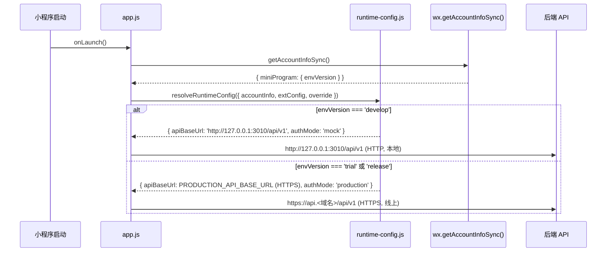
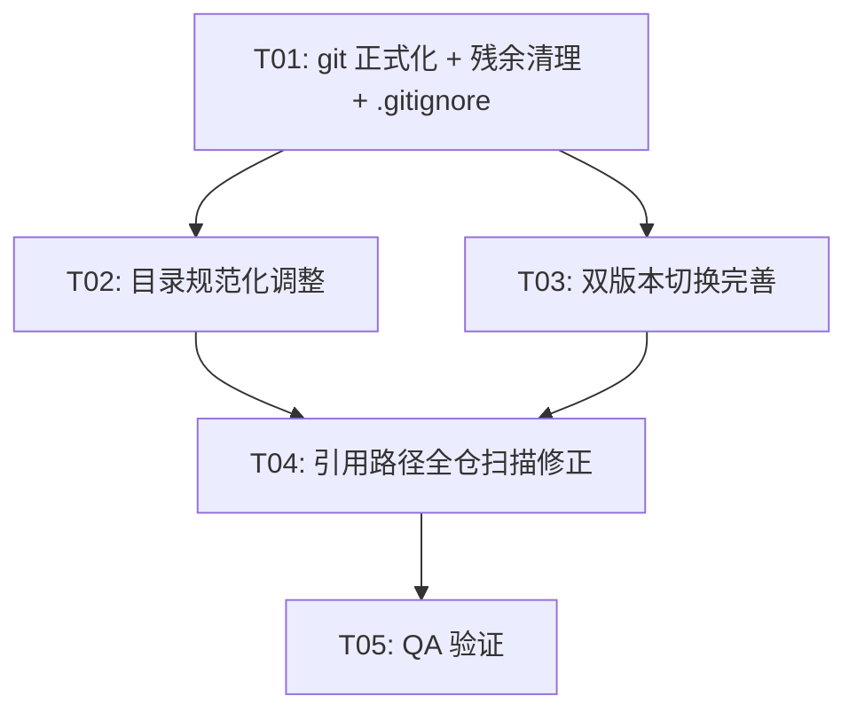

# Monorepo 根目录规范化 + 双版本切换 · 设计方案

> 版本: v1.0 | 日期: 2026-07-21
> 作者: 架构师 Bob
> 范围: 根目录 git 正式化 + 残余清理 + 目录规范化（腾讯小程序规范）+ 双版本切换完善 + 引用路径修正
> 前置文档: `docs/superpowers/specs/2026-07-20-legacy-removal-new-only-design.md`、`docs/superpowers/plans/2026-07-21-root-monorepo-cleanup.md`
> 用户确认决策: ① master 提交当前结构后删 feature 分支 ② 单套代码 + envVersion + runtime-config.js 切换 ③ 腾讯目录规范 + 阿里前端规范

---

## 1. 目录规范化方案

### 1.1 对照腾讯小程序目录规范逐项检查

> 腾讯规范标准结构：`app.js` / `app.json` / `app.wxss` / `project.config.json` / `sitemap.json` + `pages/`(四件套) + `components/`(四件套) + `utils/` + `assets/`(images,fonts,icons) + `constants/` + `styles/` + `miniprogram_npm/`(不入库)

| # | 目录/文件 | 当前状态 | 规范要求 | 动作 | 理由 |
|---|-----------|----------|----------|------|------|
| 1 | `app.js` | ✅ 存在 | 入口文件 | 保留 | 符合规范 |
| 2 | `app.json` | ✅ 存在，pages + tabBar + usingComponents | 页面注册配置 | 保留 | 符合规范 |
| 3 | `app.wxss` | ✅ 存在，引入 miniprogram_npm + 本地样式 | 全局样式 | 保留 | 符合规范 |
| 4 | `project.config.json` | ✅ 存在，compileType=miniprogram, appid 正确 | 项目配置 | 保留（T03 微调 condition） | 符合规范；envVersion 是运行时值不需写入 |
| 5 | `sitemap.json` | ❌ 不存在 | 页面索引配置（腾讯要求） | **新增** | 腾讯规范必备文件，控制页面被微信搜索索引 |
| 6 | `pages/` | ✅ 11 个页面，每个四件套齐全 | 每页 .js/.json/.wxml/.wxss | 保留 | 完全符合规范 |
| 7 | `components/schedule-grid/` | ✅ 四件套 + logic.js | 组件四件套 | 保留 | 符合规范；logic.js 是组件辅助逻辑，可接受 |
| 8 | `utils/` | ✅ api.js, runtime-config.js, env-settings.js, time-format.js, candidate-assignment.js, catalog-labels.js | 工具函数 | 保留 | 符合规范 |
| 9 | `constants/` | ✅ error-codes.js, time-modes.js, schedule-profiles.seed.json | 常量定义 | 保留 | 符合规范 |
| 10 | `styles/` | ✅ design-tokens.wxss, tdesign-icon-font-local.wxss | 公共样式 | 保留 | 符合规范 |
| 11 | `assets/fonts/t.woff` | ✅ 仅 fonts/ 子目录 | assets/ 下分 images/fonts/icons | **调整**（预留结构） | 当前只有字体无图片；保留 fonts/，约定未来 images/icons 放对应子目录 |
| 12 | `domain/` | ⚠️ 5 个纯业务逻辑 js（date-defaults, group-name, name-parser, period-builder, slot-selection） | 规范未定义 domain/ | **保留** | DDD 领域层，纯函数无 wx 依赖，独立为 domain/ 体现分层架构，内聚合理；阿里规范无禁止 |
| 13 | `tools/` | ⚠️ 仅 patch-tdesign-icon-font.mjs（Node 构建脚本） | 规范未定义 tools/ | **保留** | 小程序构建工具脚本，通过 package.json `postbuild-npm`/`patch:icon-font` 调用，与 package.json 内聚配套 |
| 14 | `miniprogram_npm/` | 构建产物（本地存在） | 不入库 | 确认 .gitignore | 已在 .gitignore `miniprogram_npm/`（通配）覆盖 ✓ |
| 15 | `package.json` | ✅ 存在，@scheduling/miniprogram | npm 依赖声明 | 保留 | workspaces 子包配置 |
| 16 | `project.private.config.json` | 本地私有配置 | 不入库 | 确认 .gitignore | 已在 .gitignore ✓ |

### 1.2 规范化动作汇总

| 动作 | 涉及文件 | 说明 |
|------|----------|------|
| **新增** | `apps/miniprogram/sitemap.json` | 标准内容：`{"desc":"小程序页面索引","rules":[{"action":"allow","page":"*"}]}` |
| **调整** | `apps/miniprogram/assets/` | 保留 `fonts/`；约定未来 `images/`、`icons/` 子目录（暂不创建空目录） |
| **保留** | `domain/`、`tools/` | 不符合腾讯标准目录但符合分层/内聚原则，保留并在 README 说明 |
| **确认** | `.gitignore` | 确认 `miniprogram_npm/`、`project.private.config.json` 已忽略（✓） |

### 1.3 阿里前端规范符合性

| 规范项 | 当前状态 | 动作 |
|--------|----------|------|
| 目录命名 kebab-case | ✅ 全部小写中划线 | 无需改动 |
| JS 文件小写 | ✅ 全部小写 | 无需改动 |
| 组件文件名 | schedule-grid（kebab-case，腾讯组件规范） | 保留（小程序组件用 kebab-case 是腾讯约定） |
| 文件头注释 | domain/ 有 JSDoc，部分 utils 有 | 建议补全（非阻塞） |
| .editorconfig | ✅ 已有（space/2, utf-8, lf） | 保留 |
| ESLint + Prettier | ❌ 未配置 | **待明确**（见 §6，本轮可选） |
| 禁止 .bat 文件 | ✅ 无 .bat | 环境切换用 npm scripts |

---

## 2. 双版本切换设计

### 2.1 envVersion 机制说明

微信小程序的 `envVersion` 是**运行时值**，由微信平台注入，通过 `wx.getAccountInfoSync().miniProgram.envVersion` 获取：

| envVersion | 含义 | 获取方式 |
|------------|------|----------|
| `develop` | 开发版 | DevTools 运行 / 开发版扫码 |
| `trial` | 体验版 | 上传后设为体验版 |
| `release` | 正式版 | 审核通过发布后 |

> ⚠️ `envVersion` **不是** project.config.json 的配置项，不需要也不应该写入 project.config.json。它由微信运行时自动注入。

### 2.2 runtime-config.js 切换逻辑（现状 + 完善点）

**现状**（`apps/miniprogram/utils/runtime-config.js`）：

```js
const LOCAL_API_BASE_URL = 'http://127.0.0.1:3010/api/v1';

function resolveRuntimeConfig({ accountInfo, extConfig, override }) {
  const envVersion = accountInfo?.miniProgram?.envVersion || 'develop';
  const isDevelop = envVersion === 'develop';
  // develop → LOCAL_API_BASE_URL（可被 storage/extConfig 覆盖）
  // trial/release → 必须从 extConfig 获取 HTTPS URL，否则报错
}
```

**问题 1 — 端口不一致**：

| 位置 | 端口 | 说明 |
|------|------|------|
| `runtime-config.js` LOCAL_API_BASE_URL | **3010** | 小程序指向 |
| `.env.example` API_PORT | **3000** | 后端模板 |
| `services/api/src/config/env.schema.ts` | **3000** (default) | 后端默认 |

用户确认开发地址为 `127.0.0.1:3010`，故需统一后端为 **3010**。

**问题 2 — trial/release 无 fallback**：

当前 trial/release 必须从 `extConfig.apiBaseUrl` 获取地址。但独立小程序（非第三方平台代开发）的 `wx.getExtConfigSync()` 通常返回空对象，导致 `configurationError`。需增加生产域名常量作为 fallback。

**完善方案**：

```js
// apps/miniprogram/utils/runtime-config.js（修改后）
const LOCAL_API_BASE_URL = 'http://127.0.0.1:3010/api/v1';
// 生产/体验环境 API 地址（HTTPS，需在小程序后台配置 request 合法域名）
// 独立小程序 fallback；若接入第三方平台则 extConfig 优先
const PRODUCTION_API_BASE_URL = 'https://api.scheduling.example.com/api/v1'; // ← 待用户填写实际域名

function resolveRuntimeConfig({ accountInfo = {}, extConfig = {}, override = {} } = {}) {
  const envVersion = accountInfo?.miniProgram?.envVersion || 'develop';
  const isDevelop = envVersion === 'develop';
  const configuredUrl = normalizeBaseUrl(override.apiBaseUrl || extConfig.apiBaseUrl);

  if (isDevelop) {
    // 开发版：本地 API，可被 storage/extConfig 覆盖
    const apiBaseUrl = configuredUrl || LOCAL_API_BASE_URL;
    // ...（authMode 逻辑不变）
    return { apiBaseUrl, authMode, envVersion, isDevelop: true, configurationError: ... };
  }

  // trial/release：extConfig > PRODUCTION 常量 > 报错
  const resolvedUrl = configuredUrl || normalizeBaseUrl(PRODUCTION_API_BASE_URL);
  const secure = /^https:\/\//i.test(resolvedUrl);
  return {
    apiBaseUrl: secure ? resolvedUrl : '',
    authMode: 'production',
    envVersion,
    isDevelop: false,
    configurationError: secure ? '' : '体验版和正式版必须配置 HTTPS API 地址',
  };
}
```

### 2.3 后端双环境配合

| 维度 | 开发环境 | 生产环境 |
|------|----------|----------|
| 环境文件 | `.env`（本地，不入库） | `.env.production`（本地，不入库） |
| 模板文件 | `.env.example`（入库） | `.env.production.example`（入库） |
| Compose 文件 | `docker-compose.yml` | `docker-compose.production.yml` |
| NODE_ENV | development | production |
| WECHAT_MODE | mock | production |
| MySQL | 127.0.0.1:3307 | mysql:3306 |
| Redis | 127.0.0.1:6380 | redis:6379 |
| API_PORT | **3010**（需统一） | 3000（容器内，nginx 反代） |
| 小程序 API 地址 | `http://127.0.0.1:3010/api/v1` | `https://api.<域名>/api/v1` |

**端口统一修改**：

| 文件 | 修改 |
|------|------|
| `.env.example` | `API_PORT=3000` → `API_PORT=3010` |
| `.env.production.example` | `API_PORT=3000` → `API_PORT=3000`（保持，容器内端口） |
| `services/api/src/config/env.schema.ts` | `API_PORT: port.default(3000)` → `port.default(3010)` |

### 2.4 切换操作说明（npm scripts，不生成 .bat）

**后端开发环境启动**：

```bash
npm install                    # 安装依赖
npm run infra:up               # 启动 MySQL/Redis/MinIO（docker-compose.yml）
npm run db:migrate             # 数据库迁移
npm run build                  # 构建 contracts + api
npm run dev:api                # 启动 API（开发模式，端口 3010）
# 健康检查：curl http://127.0.0.1:3010/health/live
```

**后端生产环境部署**：

```bash
cp .env.production.example .env.production  # 填写实际密钥
docker compose -f docker-compose.production.yml up -d --build
# nginx 反代 80/443 → api:3000
```

**小程序环境切换**：

| 环境 | 操作 | envVersion | API 地址来源 |
|------|------|------------|-------------|
| 开发 | DevTools 打开 `apps/miniprogram` | develop（自动） | LOCAL_API_BASE_URL (127.0.0.1:3010) |
| 开发覆盖 | DevTools 编译模式加 `reset=1` 清缓存；或 storage 写入 override | develop | storage override |
| 体验 | 上传 → 设为体验版 | trial | PRODUCTION_API_BASE_URL / extConfig |
| 正式 | 审核通过发布 | release | PRODUCTION_API_BASE_URL / extConfig |

> 小程序端无需 npm scripts 切换环境——envVersion 由微信运行时自动判断，runtime-config.js 自动路由。

### 2.5 project.config.json 微调（可选）

在 `condition` 字段配置编译模式快捷入口（方便 DevTools 切换测试场景）：

```json
"condition": {
  "miniprogram": {
    "list": [
      { "name": "首页", "pathName": "pages/home/home", "query": "" },
      { "name": "清缓存启动", "pathName": "pages/login/login", "query": "reset=1" }
    ]
  }
}
```

### 2.6 双版本切换流程图



---

## 3. git 提交策略

### 3.1 当前 git 状态

| 类别 | 数量 | 说明 |
|------|------|------|
| 未跟踪 (??) | 28 | 新平台代码（apps/services/packages/infra/tools/docs + 根配置文件 + ChatGPT PNG） |
| 已暂存删除 (D) | 208 | 旧栈文件（backend/miniprogram/shared/admin-web/.claude/.workbuddy/.codebuddy） |
| 修改 (M) | 2 | .gitignore 等 |
| 残余空目录 | 1 | `backend/`（内容已 staged 删除但空目录残留） |
| 分支 | 3 | master（当前）、feature/new-platform-foundation（+70 commits）、feat-design-miniprogram-ui-Pcn9qn |

### 3.2 备份策略（先做）

```bash
# 在任何操作前打 tag 保险
git tag backup/pre-normalization-20260721

# 确认 tag 已创建
git tag -l "backup/*"
```

> 如需回滚：`git reset --hard backup/pre-normalization-20260721`

### 3.3 Commit 拆分方案（3 个 commit）

**Commit 1 — 移除旧栈**：

```bash
# 只暂存已跟踪文件的修改和删除（不含未跟踪新文件）
git add -u
git commit -m "chore: 移除旧栈代码与助手目录

- 删除旧微信小程序 miniprogram/
- 删除旧 Express API backend/
- 删除旧 H5 管理端 admin-web/
- 删除旧共享常量 shared/
- 清理 .claude/.workbuddy/.codebuddy 助手目录
- 更新 .gitignore

新平台代码已在 apps/services/packages 下，后续 commit 提交"
```

**Commit 2 — 提升新平台 monorepo 到根目录**：

```bash
# 暂存所有未跟踪文件（新代码 + ChatGPT PNG）
git add -A
git commit -m "feat: 新平台 monorepo 落根目录

- apps/miniprogram（微信小程序 + TDesign）
- apps/admin-web（管理端）
- services/api（NestJS/Fastify）
- services/deadline-worker/notification-worker/scheduler（微服务）
- packages/contracts（共享类型）
- infra/（MySQL/Nginx 配置）
- tools/（工作区校验、环境初始化、冒烟测试）
- docs/（规格与计划文档）
- 根配置：package.json, tsconfig.base.json, .editorconfig, redocly.yaml,
  docker-compose.yml, docker-compose.production.yml,
  .env.example, .env.production.example
- 保留 ChatGPT Image 设计参考图"
```

**Commit 3 — 目录规范化 + 双版本切换**（T02/T03 产出后）：

```bash
git add -A
git commit -m "refactor: 目录规范化与双版本切换完善

- 新增 sitemap.json（腾讯小程序规范）
- 统一开发端口为 3010（.env.example + env.schema.ts）
- runtime-config.js 增加生产域名 fallback
- project.config.json 配置编译模式快捷入口
- 修正历史文档过时路径引用
- 清理残余空目录 backend/"
```

### 3.4 删除 feature 分支

```bash
# 确认 master 已包含所有新代码（Commit 2 完成后）
git log --oneline -3

# 删除本地 feature 分支（强制，因为分支 commit 历史与 master 不同）
git branch -D feature/new-platform-foundation
git branch -D feat-design-miniprogram-ui-Pcn9qn

# 如有远程分支，一并删除（确认无远程时跳过）
# git push origin --delete feature/new-platform-foundation

# 验证
git branch -a
```

> ⚠️ `git branch -D` 是强制删除。feature 分支的 70 个 commit 会变为 dangling commits（可通过 reflog 恢复，90 天后 GC）。如需永久保留提交历史，可先 `git merge feature/new-platform-foundation --no-ff` 再删分支——但用户决策是直接删，故不 merge。

### 3.5 Conventional Commits 规范

| 类型 | 用途 | 示例 |
|------|------|------|
| `feat` | 新功能/新代码 | `feat: 新平台 monorepo 落根目录` |
| `chore` | 构建/清理/配置 | `chore: 移除旧栈代码与助手目录` |
| `refactor` | 重构（不改行为） | `refactor: 目录规范化与双版本切换完善` |
| `docs` | 文档 | `docs: 更新 README 入口说明` |
| `fix` | 修复 | `fix: 统一开发端口为 3010` |

格式：`<type>(<scope>): <中文描述>`，scope 可选（如 `feat(miniprogram): ...`）。

---

## 4. 有序任务列表

### 任务依赖图



### T01: git 正式化 + 残余清理 + .gitignore 更新

| 项 | 内容 |
|----|------|
| **编号** | T01 |
| **任务** | 打 tag 备份 → Commit 1（删旧栈）→ Commit 2（提升新代码）→ 删除残余空目录 → 删 feature 分支 |
| **涉及文件/目录** | `.gitignore`、`backend/`（空目录删除）、`miniprogram/`、`shared/`、`admin-web/`、`.claude/`、`.workbuddy/`、`.codebuddy/`（已 staged 删除）、`apps/`、`services/`、`packages/`、`infra/`、`tools/`、`docs/`、根配置文件（未跟踪新增）、`ChatGPT Image*.png` |
| **依赖任务** | 无（第一个任务） |
| **验收点** | ① `git status` 干净（无未跟踪/未暂存）② `git log --oneline -3` 显示 2 个新 commit ③ `ls backend/` 报错（目录已删）④ `git branch -a` 只剩 master ⑤ `git tag -l backup/*` 有备份 tag ⑥ `apps/` 内容完整未被误删 |

**.gitignore 补充条目**（防未来再现）：

```gitignore
# 已有条目保留，补充以下：
.workbuddy/
.worktrees/
.codebuddy/
.claude/
```

### T02: 目录规范化调整（腾讯小程序规范）

| 项 | 内容 |
|----|------|
| **编号** | T02 |
| **任务** | 新增 sitemap.json → 确认 assets/ 结构 → 确认 domain/tools 保留 → project.config.json condition 配置 |
| **涉及文件/目录** | `apps/miniprogram/sitemap.json`（新增）、`apps/miniprogram/project.config.json`（微调 condition）、`apps/miniprogram/assets/`（确认结构） |
| **依赖任务** | T01 |
| **验收点** | ① `apps/miniprogram/sitemap.json` 存在且 JSON 合法 ② `project.config.json` 可被 DevTools 正常读取 ③ `domain/`、`tools/` 保留不变 ④ assets/ 下 fonts/ 结构不变 |

**sitemap.json 内容**：

```json
{
  "desc": "智能排班小程序页面索引配置",
  "rules": [{ "action": "allow", "page": "*" }]
}
```

### T03: 双版本切换完善

| 项 | 内容 |
|----|------|
| **编号** | T03 |
| **任务** | 统一开发端口 3010 → runtime-config.js 增加生产域名 fallback → 后端 .env.example 端口统一 |
| **涉及文件/目录** | `apps/miniprogram/utils/runtime-config.js`、`.env.example`、`services/api/src/config/env.schema.ts` |
| **依赖任务** | T01 |
| **验收点** | ① `.env.example` API_PORT=3010 ② `env.schema.ts` default 3010 ③ `runtime-config.js` 有 PRODUCTION_API_BASE_URL 常量 ④ trial/release 无 extConfig 时 fallback 到 PRODUCTION 常量而非报错 ⑤ develop 仍指向 127.0.0.1:3010 |

### T04: 引用路径全仓扫描修正

| 项 | 内容 |
|----|------|
| **编号** | T04 |
| **任务** | 全仓 grep `new/`、`.worktrees`、`.workbuddy`、`.codebuddy`、旧 `miniprogram/`/`backend/` 路径引用 → 修正源码（如有）→ 历史文档加归档标注 |
| **涉及文件/目录** | `docs/superpowers/plans/*.md`（历史计划，加归档标注）、`docs/superpowers/specs/2026-07-20-legacy-removal-new-only-design.md`（过时路径标注）、`docs/operations/acceptance.md`（修正 `new/` 引用）、根 `README.md`（如存在则更新，如不存在 T01 已含） |
| **依赖任务** | T02、T03 |
| **验收点** | ① 源代码（.js/.ts/.json/.mjs）中无 `new/`、`.worktrees`、`.workbuddy`、`.codebuddy` 引用 ② `docker-compose.production.yml` 中 `apps/admin-web` 引用是有效的（新平台 admin-web，保留）③ docs/ 历史计划文档头部有归档标注 ④ `docs/operations/acceptance.md` 中 `new/` 改为根目录相对路径 |

**扫描命令**：

```bash
# 源码扫描（应无结果）
grep -rn --include="*.js" --include="*.ts" --include="*.json" --include="*.mjs" \
  -E "(\bnew/|\.worktrees|\.workbuddy|\.codebuddy)" \
  apps/ services/ packages/ tools/ infra/ 2>/dev/null

# 文档扫描（历史文档加标注后可保留引用）
grep -rn --include="*.md" \
  -E "(\bnew/|\.worktrees|\.workbuddy)" \
  docs/ 2>/dev/null
```

### T05: QA 验证

| 项 | 内容 |
|----|------|
| **编号** | T05 |
| **任务** | 目录规范验证 + 双版本验证 + 图标本地化验证 + 引用路径验证 + git 状态验证 |
| **涉及文件/目录** | 全仓（只读验证） |
| **依赖任务** | T01、T02、T03、T04 |
| **验收点** | 见下方验收清单 |

**验收清单**：

| # | 验证项 | 命令/方法 | 期望结果 |
|---|--------|-----------|----------|
| 1 | git 干净 | `git status` | nothing to commit, working tree clean |
| 2 | 分支只剩 master | `git branch -a` | 仅 master |
| 3 | 无旧栈目录 | `ls miniprogram/ backend/ shared/ admin-web/ 2>&1` | 全部不存在 |
| 4 | 无残余空目录 | `ls backend/ 2>&1` | 不存在 |
| 5 | sitemap.json 存在 | `cat apps/miniprogram/sitemap.json` | 合法 JSON |
| 6 | 端口统一 | `grep API_PORT .env.example` | 3010 |
| 7 | 端口统一 | `grep "API_PORT" services/api/src/config/env.schema.ts` | default(3010) |
| 8 | 生产域名常量 | `grep PRODUCTION_API_BASE_URL apps/miniprogram/utils/runtime-config.js` | 存在 |
| 9 | 图标本地化 | `grep -r "http" apps/miniprogram/styles/tdesign-icon-font-local.wxss` | 无远程 URL |
| 10 | 图标本地化 | `grep -r "<image" apps/miniprogram/pages/ \| grep "http"` | 无远程 image |
| 11 | 无禁用路径 | 源码 grep `new/`、`.worktrees` 等 | 无结果 |
| 12 | miniprogram_npm 已忽略 | `git check-ignore apps/miniprogram/miniprogram_npm/` | 返回该路径（已忽略） |
| 13 | ChatGPT PNG 已跟踪 | `git ls-files "ChatGPT*"` | 返回文件名 |
| 14 | DevTools 可打开 | 手动验证 | 打开 apps/miniprogram 无报错 |

---

## 5. 共享知识（跨文件约定）

### 5.1 路径引用约定

| 约定 | 说明 |
|------|------|
| **根目录相对路径** | 所有配置文件、docker-compose、文档使用根目录相对路径（如 `./apps/miniprogram`、`./services/api`） |
| **禁止引用** | 禁止任何源码/配置引用 `new/`、`.worktrees/`、`.workbuddy/`、`.codebuddy/`、`.claude/` 路径 |
| **禁止引用旧栈** | 禁止引用 `miniprogram/`（旧）、`backend/`（旧）、`shared/`（旧）、`admin-web/`（旧根目录）—— 注意区分 `apps/admin-web`（新，有效） |
| **小程序内部引用** | 使用小程序相对路径（如 `../../utils/api.js`），不使用绝对路径 |
| **后端引用** | TypeScript 使用 NodeNext 模块解析，相对路径或 workspace 包名（`@scheduling/contracts`） |

### 5.2 环境变量约定

| 约定 | 说明 |
|------|------|
| **环境文件不入库** | `.env`、`.env.production` 被 .gitignore 忽略；只有 `.env.example`、`.env.production.example` 入库 |
| **密钥占位** | example 文件中密钥留空（如 `MYSQL_PASSWORD=`），实际值在本地 .env 填写 |
| **端口约定** | 开发环境 API_PORT=3010（避免与本地其他服务冲突）；生产容器内 3000（nginx 反代） |
| **WECHAT_MODE** | 开发=mock（模拟微信登录）；生产=production（真实微信登录） |
| **小程序 API 地址** | develop → runtime-config.js LOCAL_API_BASE_URL；trial/release → PRODUCTION_API_BASE_URL 或 extConfig |

### 5.3 目录结构约定

| 约定 | 说明 |
|------|------|
| `apps/miniprogram/domain/` | 领域层纯函数（无 wx 依赖），业务逻辑放此 |
| `apps/miniprogram/tools/` | 小程序构建工具脚本（Node.js 运行，非小程序运行时） |
| `apps/miniprogram/assets/fonts/` | 字体文件；未来 images/icons 放对应子目录 |
| `apps/miniprogram/miniprogram_npm/` | 构建产物，不入库，通过 DevTools「构建 npm」生成 |

---

## 6. 待明确事项

| # | 事项 | 影响 | 建议 |
|---|------|------|------|
| 1 | **生产 API 域名** | runtime-config.js 的 `PRODUCTION_API_BASE_URL` 需填实际 HTTPS 域名 | 用户提供域名后填入；填入后需在小程序后台「开发管理 → 服务器域名」配置 request 合法域名。当前方案先用占位符 `https://api.scheduling.example.com/api/v1`，上线前替换 |
| 2 | **端口统一确认** | .env.example 当前 3000，runtime-config 当前 3010 | 本方案建议统一为 3010（与用户确认的「开发=127.0.0.1:3010」一致）。如用户实际期望 3000，则反向修改 runtime-config.js 即可 |
| 3 | **extConfig 方案** | 独立小程序 extConfig 通常为空 | 本方案用 PRODUCTION_API_BASE_URL 常量 fallback。若未来接入第三方平台代开发，可改用 extConfig 注入（runtime-config.js 已支持 extConfig 优先） |
| 4 | **ESLint + Prettier** | 阿里规范要求，当前未配置 | 本轮非阻塞（目录/路径清理优先）。建议作为 follow-up：添加 `.eslintrc.cjs` + `.prettierrc`，配置 `eslint-config-ali` + `eslint-plugin-miniprogram` |
| 5 | **feat-design-miniprogram-ui-Pcn9qn 分支** | 另一个本地分支，用途不明 | 本方案建议一并删除（与 feature 分支同处理）。如需保留请告知 |
| 6 | **docs/ 历史文档处理** | plans/ 下文档大量引用 `new/`（历史路径） | 本方案建议加归档标注（文件头注明「历史计划，路径已过时，代码已提升到根目录」），不逐行改正文。如需逐行修正请告知 |
| 7 | **README.md** | 根目录当前无 README.md | legacy-removal 设计文档 §5 要求新建根 README。本方案在 T01 Commit 2 中纳入（如已存在则更新）。如未存在需新增 |

---

## 附录 A: 目标目录结构（规范化后）

```
排班小程序/                         # 仓库根 = monorepo 根
├── .editorconfig
├── .env                            # 本地开发（不入库）
├── .env.example                    # 开发模板（入库）
├── .env.production                 # 生产（不入库）
├── .env.production.example         # 生产模板（入库）
├── .gitignore
├── ChatGPT Image 2026年7月18日 20_46_47.png
├── docker-compose.yml              # 开发环境
├── docker-compose.production.yml   # 生产环境
├── package.json                    # workspaces 根
├── package-lock.json
├── redocly.yaml
├── tsconfig.base.json
├── apps/
│   ├── admin-web/
│   └── miniprogram/                # ← 微信开发者工具打开此目录
│       ├── app.js
│       ├── app.json
│       ├── app.wxss
│       ├── project.config.json
│       ├── sitemap.json            # ← T02 新增
│       ├── package.json
│       ├── assets/
│       │   └── fonts/t.woff
│       ├── components/schedule-grid/
│       ├── constants/
│       ├── domain/                 # 领域层（保留）
│       ├── pages/                  # 11 页四件套
│       ├── styles/
│       ├── tools/                  # 构建脚本（保留）
│       └── utils/
├── services/
│   ├── api/                        # NestJS/Fastify
│   ├── deadline-worker/
│   ├── notification-worker/
│   └── scheduler/
├── packages/
│   └── contracts/
├── infra/
│   ├── mysql/
│   └── nginx/
├── tools/                          # monorepo 级工具
└── docs/
    ├── operations/
    └── superpowers/
        ├── plans/
        └── specs/
```

---

**文档结束。** 工程师按 T01→T02→T03→T04→T05 顺序执行，每个任务的验收点通过后再进入下一个。
